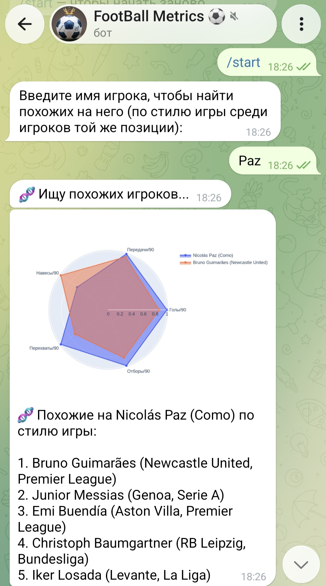
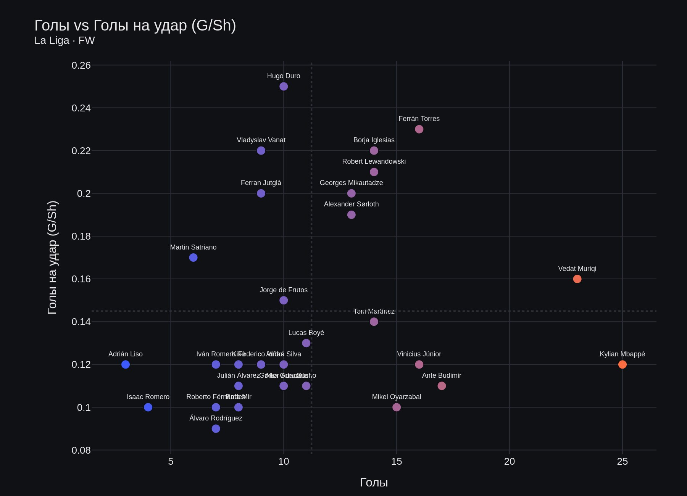
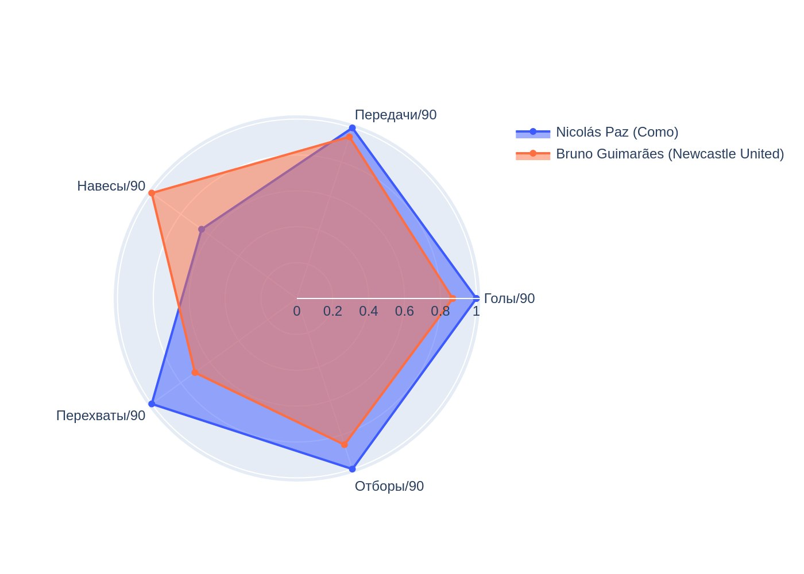

# Football Stats Bot — Часть 1

1. **Производные метрики per-90** (`data_processor.py`): `gls_90`, `ast_90`,
   `g_plus_a_90`, `int_90`, `tklw_90`, `crs_90`. В исходном CSV нет xG/xA —
   использованы реальные доступные метрики (голы, передачи, удары,
   отборы, перехваты).
2. **Позиционные фильтры** — топ-N теперь можно фильтровать по амплуа
   (GK/DF/MF/FW) в дополнение к лиге.
3. **Кэширование** — `get_top_players_by_stat` обёрнут в `lru_cache`
   (256 последних уникальных комбинаций фильтров хранятся в памяти).
4. **Inline-кнопки + пагинация** — весь бот теперь на
   `CallbackQueryHandler`, меню редактируются на месте. Список статистик
   (14 штук) постранично, по 6 на страницу, с кнопками ◀️/▶️.
5. **Сравнение двух игроков** — нечёткий поиск по имени (`rapidfuzz`),
   выбор из вариантов, затем radar-диаграмма по 4-5 метрикам, подобранным
   под позицию игрока (форварды/полузащитники/защитники/вратари — разные
   наборы метрик).
6. **Plotly + kaleido** вместо matplotlib — тёмная тема, более чистый вид.

## Структура

```
football_bot/
├── data_processor.py   # загрузка/очистка CSV, метрики, запросы, поиск игроков
├── visualizer.py        # bar chart топ-N, radar chart сравнения
├── telegram_bot.py       # весь UX бота на inline-кнопках
└── requirements.txt
```



## Важные технические заметки

- **kaleido закреплён на версии `0.2.1`** — более новые версии (`>=1.0`)
  требуют установленный Google Chrome на сервере. `0.2.1` несёт свой
  статический бинарник и не требует Chrome — проще для деплоя.
- **В данных нет xG/xA/дриблинга.** Если захотите добавить их позже
  (например, смёржив с отдельным xG-датасетом по игрокам), в
  `data_processor.py` есть чёткое место для добавления нового блока
  колонок — структура кода для этого уже готова (см. `_KEEPER_COLUMNS`,
  `_SHOOTING_COLUMNS` и т.д. как образец).
- Игроки, перешедшие в течение сезона в другой клуб (например, Himad
  Abdelli — Marseille → Angers), в датасете идут отдельными строками.
  Сейчас они обрабатываются как разные записи (с разным клубом) —
  это осознанное решение, а не баг.
- `min_nineties_default = 3.0` — игроки с < 3 полных матчей не попадают
  в топ-N по умолчанию (иначе один гол за 20 минут выбивался бы в топ-1
  по gls_90). Можно поменять в конструкторе `FootballDataProcessor`.

## Часть 2

1. **Scatter «Голы vs эффективность»** — `Gls` против `SoT%` или `G/Sh`.
   Точки выше среднего по обеим осям (пунктирные линии) — игроки, которые
   реализуют моменты стабильнее остальных при том же объёме ударов.
2. **Похожие игроки (KMeans)** — кластеризация по позиции (FW/MF/DF —
   вратари пока не поддержаны, для них слишком маленькие выборки по лигам
   для содержательной кластеризации) на нормализованных признаках, затем
   поиск ближайших соседей по евклидову расстоянию внутри кластера.
   В ответе — текстовый список топ-5 + radar-сравнение с самым похожим
   игроком (визуальное подтверждение, почему они похожи).
3. **Тренды по возрасту / лигам** — line chart среднего значения статистики
   по возрасту (с отсечкой `min_players_per_age=3`, чтобы редкие возраста
   вроде 38 лет не давали шумных выбросов на 1 игроке) и bar chart среднего
   по лигам.

### Новые файлы/функции

- `data_processor.py`: `get_scatter_data`, `_compute_clusters` (кэш),
  `find_similar_players`, `get_age_trend`, `get_league_trend`,
  константы `CLUSTER_FEATURES`, `SCATTER_PRESETS`.
- `visualizer.py`: `create_scatter_chart`, `create_age_trend_chart`,
  `create_league_trend_chart`.
- `telegram_bot.py`: три новых пункта меню и связанные состояния диалога
  (`SCATTER_*`, `SIMILAR_*`, `TREND_*`) — итого 15 состояний.

### Важные заметки по реализации

- **Кластеризация не поддерживает вратарей** — слишком мало GK на лигу для
  осмысленных кластеров k-means. Бот вежливо об этом сообщает.
- **Навигация «Назад» в новых ветках** упрощена: чтобы не плодить лишние
  состояния и не словить путаницу между `CHOOSE_POSITION` (топ-N) и
  `SCATTER_POSITION` (scatter) — обе используют одну и ту же
  `position_keyboard()`, но с разным `back_target`, — кнопка «Назад» в
  сценариях scatter/similar/trend всегда ведёт в главное меню, а не на шаг
  назад. Это осознанный компромисс ради надёжности стейт-машины.
- **Тренды по возрасту/лигам** сейчас считаются по всем позициям сразу
  (без фильтра по позиции в UI) — можно добавить фильтр по аналогии со
  scatter-флоу, если понадобится.

## Известные ограничения / что можно добавить дальше

- Фильтр по позиции в разделе «Тренды».
- Настраиваемое число игроков в топ-N (сейчас всегда 10) и в scatter
  (сейчас всегда 30 самых играющих).
- Поддержка вратарей в «Похожих игроках» (нужны отдельные фичи — % сейвов,
  % сухих матчей и т.д., они уже есть в датафрейме, просто не подключены
  к `CLUSTER_FEATURES`).
- Объединение сезонных дублей игрока (переход в течение сезона) в одну
  запись с суммой по клубам, если понадобится сравнивать "весь сезон", а
  не отдельно по каждому клубу.



